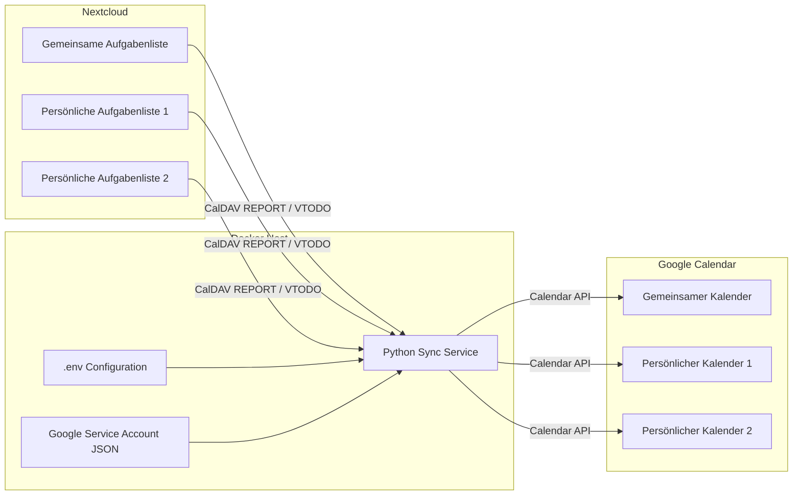
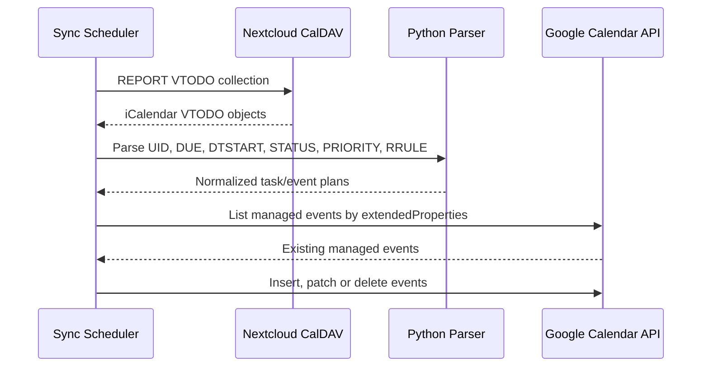

# Nextcloud Task to Google Calendar Sync

Synchronisiert Aufgaben aus Nextcloud Tasks beziehungsweise CalDAV einseitig als normale Termine in Google Calendar.

Das Projekt unterstützt einen gemeinsamen Aufgabenpfad sowie bis zu zwei optionale persönliche Aufgabenpfade:

- gemeinsame Nextcloud-Aufgabenliste → gemeinsamer Google-Kalender,
- persönliche Nextcloud-Aufgabenliste 1 → persönlicher Google-Kalender 1,
- persönliche Nextcloud-Aufgabenliste 2 → persönlicher Google-Kalender 2.

Nextcloud bleibt das führende Aufgabensystem. Google Calendar dient als native Anzeige- und Erinnerungsebene auf Android, im Browser und in anderen Google-Calendar-Clients.

## Idempotent updates

Version 0.2.3 uses the `syncFingerprint` private Google Calendar event property as the primary update decision. Existing legacy events are migrated once. Subsequent runs skip PATCH requests when the fingerprint is unchanged.


## Version

`0.2.0`

## Synopse

```text
Nextcloud Tasks / CalDAV VTODO
        ↓
Python synchronization service in Docker
        ↓
Google Calendar API
        ↓
Shared and personal Google calendars
```

## Projektziel

Google Tasks unterstützt keine frei gemeinsam nutzbaren Aufgabenlisten, die automatisch bei allen beteiligten Personen im Kalender erscheinen. Nextcloud Tasks und Tasks.org können gemeinsame sowie persönliche Aufgaben dagegen sauber über CalDAV verwalten.

Dieses Projekt verbindet beide Systeme:

1. Aufgaben werden in Nextcloud Tasks oder Tasks.org erstellt und gepflegt.
2. Der Docker-Dienst liest die ausgewählten CalDAV-Aufgabenlisten.
3. Für jede relevante Aufgabe wird ein normaler Google-Kalendertermin erzeugt oder aktualisiert.
4. Überfällige offene Aufgaben werden optional auf den aktuellen Tag verschoben, wobei die ursprüngliche Uhrzeit erhalten bleibt.
5. Fertiggestellte oder abgebrochene Aufgaben werden je nach Konfiguration markiert oder entfernt.

## Architektur



### Datenfluss



## Verwendete Bestandteile

### Nextcloud Tasks / CalDAV

Nextcloud stellt Aufgaben als iCalendar-Komponenten vom Typ `VTODO` über CalDAV bereit. Jede konfigurierte Quelle verweist direkt auf eine bestimmte CalDAV-Aufgabenliste beziehungsweise Kalender-Collection.

Verarbeitete Eigenschaften:

- `UID`
- `SUMMARY`
- `DESCRIPTION`
- `DUE`
- `DTSTART`
- `STATUS`
- `PERCENT-COMPLETE`
- `COMPLETED`
- `PRIORITY`
- `LAST-MODIFIED`
- `URL`
- `RRULE`
- `RDATE`
- `EXDATE`
- `RECURRENCE-ID`

### Python-Synchronisationsdienst

Das Python-Script übernimmt:

- CalDAV-REPORT-Abfragen,
- iCalendar-/VTODO-Parsing,
- Zeitzonenbehandlung,
- Prioritäts- und Statusabbildung,
- Berechnung überfälliger Termine,
- Expansion von Serienaufgaben,
- Vergleich mit vorhandenen Google-Terminen,
- Erstellen, Aktualisieren und Löschen von Google-Terminen.

Der Dienst läuft dauerhaft in einer Schleife. Das Intervall wird über `SYNC_INTERVAL_SECONDS` gesteuert. Bei `0` erfolgt genau ein Durchlauf, danach beendet sich der Container.

### Google Calendar API

Die Anwendung verwendet einen Google Service Account und den Scope:

```text
https://www.googleapis.com/auth/calendar.events
```

Der Service Account benötigt auf jedem Zielkalender die Berechtigung, Termine zu ändern.

Die Zuordnung zwischen Nextcloud-Aufgabe und Google-Termin wird in privaten Google-Event-Metadaten gespeichert:

```text
source=nextcloud-task-google-calendar-sync
sourceKey=<VTODO UID or recurring occurrence key>
syncTarget=shared|personal1|personal2
nextcloudTaskUid=<VTODO UID>
```

Dadurch ist keine separate Datenbank erforderlich.

### Docker

Der Container basiert auf:

```dockerfile
FROM python:3.12-slim
```

Das Image enthält nur Python, die gepinnten Abhängigkeiten und das Synchronisationsscript. Secrets werden ausschließlich als Read-only-Volume eingebunden.

## Synchronisationsziele

Version 0.2.3 unterstützt drei logisch getrennte Ziele.

| Ziel-ID | Zweck | Standard |
|---|---|---:|
| `shared` | gemeinsame Aufgabenliste in gemeinsamen Kalender | aktiviert |
| `personal1` | persönliche Aufgabenliste 1 in persönlichen Kalender 1 | deaktiviert |
| `personal2` | persönliche Aufgabenliste 2 in persönlichen Kalender 2 | deaktiviert |

Jedes Ziel besitzt:

- eigene CalDAV-URL,
- eigenen Nextcloud-Benutzernamen,
- eigenes Nextcloud-App-Passwort,
- eigene Google-Kalender-ID,
- eigenen Anzeigenamen.

Fehler eines persönlichen Ziels blockieren die übrigen Ziele nicht. Der Dienst verarbeitet alle Ziele getrennt und protokolliert Fehler je Ziel-ID.

## Funktionsumfang

### Datum und Uhrzeit

- Eine VTODO-Uhrzeit aus `DUE` wird unverändert übernommen.
- Fehlt `DUE`, wird `DTSTART` als Fallback verwendet.
- Enthält die Aufgabe nur ein Datum, wird `DEFAULT_EVENT_TIME` verwendet.
- Die Terminlänge wird mit `EVENT_DURATION_MINUTES` festgelegt.
- Wird eine Aufgabe in Nextcloud hinsichtlich Datum oder Uhrzeit geändert, wird der vorhandene Google-Termin gepatcht.

### Überfällige Aufgaben

Bei:

```env
OVERDUE_MODE=move_to_today
```

wird eine offene überfällige Aufgabe auf das jeweilige heutige Datum verschoben. Die ursprüngliche Due-Uhrzeit bleibt erhalten.

Beispiel:

```text
Original: 2026-06-20 17:30
Heute:    2026-06-25
Event:    2026-06-25 17:30
```

Der Titel enthält zusätzlich das ursprüngliche Fälligkeitsdatum.

### Status

| Nextcloud-/VTODO-Status | Standardpräfix | Bedeutung |
|---|---:|---|
| `NEEDS-ACTION` | `☐` | Handlungsbedarf |
| `IN-PROCESS` | `▶` | In Bearbeitung |
| `COMPLETED` | `✓` | Fertiggestellt |
| `CANCELLED` | `✕` | Abgebrochen |

Der Darstellungsmodus wird über `STATUS_TITLE_MODE` konfiguriert:

- `emoji`
- `label`
- `none`

### Priorität

| VTODO-Priorität | Kategorie | Standardpräfix |
|---:|---|---:|
| `1–3` | hoch | `🔴` |
| `4–6` | mittel | `🟠` |
| `7–9` | niedrig | `🔵` |
| `0` oder leer | keine | kein Präfix |

Der Darstellungsmodus wird über `PRIORITY_TITLE_MODE` konfiguriert:

- `emoji`
- `label`
- `none`

Die Google-Eventfarbe wird bewusst nicht verändert. Dadurch bleibt die Kalenderfarbe als Kennzeichnung des gemeinsamen oder persönlichen Kalenders erhalten.

### Serienaufgaben

Serienaufgaben werden aus `RRULE`, `RDATE` und `EXDATE` berechnet und als einzelne Google-Termine angelegt.

Die Verwendung einzelner Termine statt einer Google-Terminserie ist beabsichtigt:

- einzelne Vorkommen können unabhängig aktualisiert werden,
- überfällige Vorkommen können auf heute verschoben werden,
- Ausnahmen und entfernte Vorkommen lassen sich gezielt löschen,
- Aufgabenstatus lässt sich zuverlässiger abbilden.

Konfigurationsparameter:

```env
RECURRENCE_EXPAND_DAYS=180
RECURRENCE_LOOKBACK_DAYS=30
RECURRENCE_INCLUDE_LATEST_OVERDUE=true
```

## Voraussetzungen

- Docker Engine
- Docker Compose Plugin
- erreichbarer Nextcloud-Server mit Tasks-/CalDAV-Unterstützung
- für jede Quelle ein Nextcloud-App-Passwort
- Google Cloud Projekt mit aktivierter Google Calendar API
- Google Service Account mit JSON-Key
- Schreibfreigabe des Service Accounts auf allen Zielkalendern

## Installation

### 1. Projekt ablegen

```bash
mkdir -p /opt/nextcloud-task-google-calendar-sync
cd /opt/nextcloud-task-google-calendar-sync
```

Projektdateien in dieses Verzeichnis kopieren.

### 2. Konfiguration erzeugen

```bash
cp .env.example .env
```

Danach `.env` bearbeiten.

### 3. Service-Account-Key ablegen

```bash
mkdir -p secrets
cp /path/to/google-service-account.json secrets/google-service-account.json
chmod 600 secrets/google-service-account.json
```

Der Key wird im Container standardmäßig unter folgendem Pfad eingebunden:

```text
/app/secrets/google-service-account.json
```

### 4. Zielkalender freigeben

Jeden Google-Zielkalender mit der E-Mail-Adresse des Service Accounts teilen und die Berechtigung zum Ändern von Terminen vergeben.

Für einen persönlichen primären Google-Kalender ist die Kalender-ID üblicherweise die Google-E-Mail-Adresse des Benutzers. Auch dieser Kalender muss explizit mit dem Service Account geteilt werden.

### 5. Erststart im Dry-Run

```env
DRY_RUN=true
LOG_LEVEL=DEBUG
```

```bash
docker compose up -d --build
docker compose logs -f
```

Im Dry-Run werden keine Google-Termine erstellt, geändert oder gelöscht.

### 6. Produktivbetrieb aktivieren

```env
DRY_RUN=false
LOG_LEVEL=INFO
```

```bash
docker compose up -d
```

## Konfiguration

### Gemeinsames Ziel

```env
SHARED_ENABLED=true
SHARED_NAME=Gemeinsame Aufgaben
SHARED_NC_CALDAV_URL=https://cloud.example.com/remote.php/dav/calendars/shared-user/family-tasks/
SHARED_NC_USERNAME=shared-user
SHARED_NC_PASSWORD=<nextcloud-app-password>
SHARED_GOOGLE_CALENDAR_ID=<calendar-id>@group.calendar.google.com
```

Zur Rückwärtskompatibilität akzeptiert das gemeinsame Ziel weiterhin:

```env
NC_CALDAV_URL=...
NC_USERNAME=...
NC_PASSWORD=...
GOOGLE_CALENDAR_ID=...
```

Die neuen `SHARED_*`-Variablen haben Vorrang.

### Persönliches Ziel 1

```env
PERSONAL1_ENABLED=true
PERSONAL1_NAME=Persönliche Aufgaben Markus
PERSONAL1_NC_CALDAV_URL=https://cloud.example.com/remote.php/dav/calendars/markus/personal-tasks/
PERSONAL1_NC_USERNAME=markus
PERSONAL1_NC_PASSWORD=<nextcloud-app-password>
PERSONAL1_GOOGLE_CALENDAR_ID=markus@example.com
```

### Persönliches Ziel 2

```env
PERSONAL2_ENABLED=true
PERSONAL2_NAME=Persönliche Aufgaben Partnerin
PERSONAL2_NC_CALDAV_URL=https://cloud.example.com/remote.php/dav/calendars/partner/personal-tasks/
PERSONAL2_NC_USERNAME=partner
PERSONAL2_NC_PASSWORD=<nextcloud-app-password>
PERSONAL2_GOOGLE_CALENDAR_ID=partner@example.com
```

### Globale Parameter

| Variable | Standard | Beschreibung |
|---|---:|---|
| `TZ` | `Europe/Berlin` | lokale Zeitzone |
| `SYNC_INTERVAL_SECONDS` | `600` | Sync-Intervall; `0` = ein Durchlauf |
| `LOG_LEVEL` | `INFO` | Logging-Level |
| `DRY_RUN` | `false` | keine Google-Schreiboperationen |
| `DEFAULT_EVENT_TIME` | `08:00` | Fallback bei Aufgaben ohne Uhrzeit |
| `EVENT_DURATION_MINUTES` | `15` | Dauer der Google-Termine |
| `REMINDER_MINUTES` | `0` | Popup-Erinnerung vor Terminbeginn |
| `IGNORE_UNDATED_TASKS` | `true` | Aufgaben ohne Fälligkeit ignorieren |
| `OVERDUE_MODE` | `move_to_today` | Umgang mit überfälligen Aufgaben |
| `COMPLETED_MODE` | `mark_done` | `mark_done` oder `delete_event` |
| `CANCELLED_MODE` | `mark_cancelled` | `mark_cancelled` oder `delete_event` |
| `STATUS_TITLE_MODE` | `emoji` | `emoji`, `label` oder `none` |
| `PRIORITY_TITLE_MODE` | `emoji` | `emoji`, `label` oder `none` |
| `RECURRENCE_EXPAND_DAYS` | `180` | zukünftiger Serienhorizont |
| `RECURRENCE_LOOKBACK_DAYS` | `30` | Rückblick für überfällige Serienvorkommen |

## Docker Compose

```yaml
services:
  nextcloud-task-google-calendar-sync:
    build: .
    container_name: nextcloud-task-google-calendar-sync
    restart: unless-stopped
    env_file:
      - .env
    volumes:
      - ./secrets:/app/secrets:ro
    environment:
      TZ: ${TZ:-Europe/Berlin}
```

Der Container benötigt keine eingehenden Ports.

## Dependency-Management

### Dateien

```text
requirements.in   direkte Abhängigkeiten
requirements.txt  vollständig gepinnte Lock-Datei
```

`requirements.txt` wird nicht manuell gepflegt. Das mitgelieferte `update_stack.sh` erzeugt sie über `pip-compile` innerhalb desselben Python-Dockerimages, das auch im Dockerfile verwendet wird.

### Kontrolliertes Update

```bash
chmod +x update_stack.sh
./update_stack.sh
```

Das Script:

1. sichert die funktionierende `requirements.txt` unter `./backups/`,
2. verwendet das Python-Image aus dem Dockerfile,
3. aktualisiert die Abhängigkeiten mit `pip-compile`,
4. zeigt einen Diff,
5. baut das Image mit aktualisiertem Basisimage,
6. startet den Stack optional neu.

Backup-Namen:

```text
backups/YYMMDD_requirements.txt
backups/YYMMDD_HHMMSS_requirements.txt
```

Empfohlen wird ein Update zunächst mit `DRY_RUN=true`.

## Betrieb

### Logs anzeigen

```bash
docker compose logs -f
```

### Status anzeigen

```bash
docker compose ps
```

### Neu bauen

```bash
docker compose build --pull
docker compose up -d
```

### Einmaliger Durchlauf

In `.env`:

```env
SYNC_INTERVAL_SECONDS=0
```

Dann:

```bash
docker compose run --rm nextcloud-task-google-calendar-sync
```

## Fehlerbehandlung

### CalDAV 404

Typische Ursache ist eine falsche Collection-URL.

Korrektes Muster:

```text
https://cloud.example.com/remote.php/dav/calendars/<user-id>/<calendar-id>/
```

Nicht verwenden:

```text
/apps/tasks/...
```

### Google Calendar 403

Prüfen:

- Calendar API im Google-Cloud-Projekt aktiviert,
- Zielkalender mit Service Account geteilt,
- Service Account besitzt Schreibrechte,
- Kalender-ID ist korrekt.

### Persönliches Ziel schlägt fehl

Die Logs enthalten die Ziel-ID:

```text
[personal1] Sync target failed: ...
```

Die anderen Ziele werden im selben Zyklus weiterhin verarbeitet.

### Unerwartete Löschungen im Dry-Run

Das Script verwaltet ausschließlich Termine mit:

```text
source=nextcloud-task-google-calendar-sync
```

Zusätzlich trennt Version 0.2.3 die Termine über `syncTarget`. Vor dem ersten Produktivstart nach einem Update sollte das Log im Dry-Run geprüft werden.

## Sicherheitskonzept

- Nextcloud-Zugangsdaten werden über `.env` injiziert.
- Für Nextcloud sollten App-Passwörter statt Hauptpasswörter verwendet werden.
- Der Google-Service-Account-Key liegt außerhalb des Images.
- Das Secret-Verzeichnis wird read-only eingebunden.
- `.env`, `secrets/` und Backups sind über `.gitignore` ausgeschlossen.
- Der Container läuft als unprivilegierter Benutzer `nobody`.
- Es werden keine eingehenden Netzwerkports geöffnet.

Empfohlene Dateirechte:

```bash
chmod 600 .env
chmod 700 secrets
chmod 600 secrets/google-service-account.json
```

## Migrationshinweise von 0.1.x

1. Die bisherige `.env` funktioniert für den gemeinsamen Sync weiter.
2. Die neuen `SHARED_*`-Variablen sind vorzuziehen.
3. Bestehende verwaltete Termine ohne `syncTarget` werden ausschließlich vom Ziel `shared` übernommen.
4. Persönliche Ziele müssen explizit mit `PERSONAL1_ENABLED=true` beziehungsweise `PERSONAL2_ENABLED=true` aktiviert werden.
5. Jeder persönliche Google-Kalender muss mit dem Service Account geteilt werden.

## Bekannte Einschränkungen

- Synchronisation nur von Nextcloud nach Google Calendar.
- Änderungen direkt am Google-Termin werden beim nächsten Sync überschrieben.
- Aufgaben ohne Datum werden standardmäßig nicht synchronisiert.
- Serienaufgaben werden als Einzeltermine und nicht als Google-Serientermin dargestellt.
- Die Synchronisation nutzt Polling und keine Push-Benachrichtigungen.
- Eine separate Historien- oder Audit-Datenbank ist nicht enthalten.

## Projektdateien

```text
.
├── .env.example
├── .gitignore
├── CHANGELOG.md
├── Dockerfile
├── README.md
├── docker-compose.yml
├── requirements.in
├── requirements.txt
├── sync_nextcloud_tasks_to_google_calendar.py
└── update_stack.sh
```

## Lizenz

Für eine öffentliche Veröffentlichung sollte eine passende Lizenzdatei ergänzt werden, beispielsweise MIT, Apache-2.0 oder GPL-3.0. Ohne `LICENSE` gelten die normalen urheberrechtlichen Einschränkungen.
